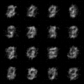

# Consistency Models

<!-- #region -->
<p align="center">

</p>

Unofficial Implementation of Consistency Models [paper](https://arxiv.org/abs/2303.01469) in pytorch.

Three days ago, legendary man [Yang Song](https://yang-song.net/) released entirely new set of generative model, called consistency model (but... without code).
Here is my attempt at it.

Results aren't crisp, but it uses naive unet and lacks some details. It does look like an MNIST if you squint your eye, so it's not a total loss.

Mainly implements consistency training:

$$
L(\theta) = \mathbb{E}[d(f_\theta(x + t_{n + 1}z, t_{n + 1}), f_\theta(x + t_n z, t_n))]
$$

And sampling:

$$
z \sim \mathcal{N}(0, I) \\
x \leftarrow x + \sqrt{t_n ^2 - \epsilon^2} z \\
x \leftarrow f_\theta(x, t_n)
$$

## Usage

```bash
python main.py
```

## Todo

- [ ] EMA
- [ ] CIFAR10 Example
- [ ] Samples are sooo fuzzy... try to get a crisp result.
