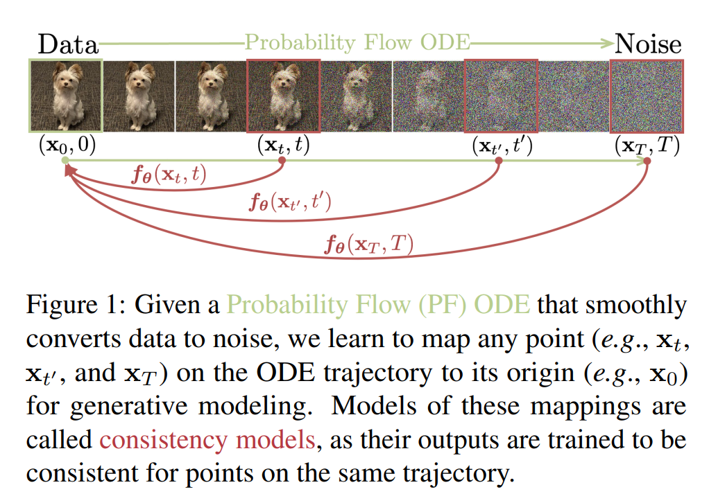
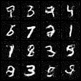
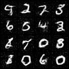

<!-- #region -->
<p align="center">

</p>
<!-- #endregion -->


# Consistency Models

<!-- #region -->
<p align="center">

</p>
<!-- #endregion -->

> 30 Epoch, Consistency Model with 2 step. Using $t_1 = 2, t_2 = 80$.

<!-- #region -->
<p align="center">

</p>
<!-- #endregion -->

> 30 Epoch, Consistency Model with 5 step. Using $t_i \in \{5, 10, 20,40, 80\}$.


Unofficial Implementation of Consistency Models  ([paper](https://arxiv.org/abs/2303.01469)) in pytorch.

Three days ago, legendary man [Yang Song](https://yang-song.net/) released entirely new set of generative model, called consistency models. There aren't yet any open implementations, so here is my attempt at it.


## What are they?

Diffusion models are amazing, because they enable you to sample high fidelity + high diversity images. Downside is, you need lots of steps, something at least 20.

Progressive Distillation (Salimans & Ho, 2022) solves this with distillating 2-steps of the diffusion model down to single step. Doing this N times boosts sampling speed by $2^N$. But is this the only way? Do we need to train diffusion model and distill it $n$ times? Yang didn't think so. Consistency model solves this by mainly trianing a model to make a consistent denosing for different timesteps (Ok I'm obviously simplifying)


## Usage

Install the package with

```bash
pip install git+https://github.com/cloneofsimo/consistency_models.git
```

This repo mainly implements consistency training:

$$
L(\theta) = \mathbb{E}[d(f_\theta(x + t_{n + 1}z, t_{n + 1}), f_{\theta_{-}}(x + t_n z, t_n))]
$$

And sampling:

$$
\begin{align}
z &\sim \mathcal{N}(0, I) \\
x &\leftarrow x + \sqrt{t_n ^2 - \epsilon^2} z \\
x &\leftarrow f_\theta(x, t_n) \\
\end{align}
$$


There is a self-contained MNIST training example on the root `main.py`.

```bash
python main.py
```

## Todo

- [x] EMA
- [x] CIFAR10 Example
- [x] Samples are sooo fuzzy... try to get a crisp result.
- [ ] Consistency Distillation

# Reference

```bibtex
@misc{https://doi.org/10.48550/arxiv.2303.01469,
  doi = {10.48550/ARXIV.2303.01469},
  
  url = {https://arxiv.org/abs/2303.01469},
  
  author = {Song, Yang and Dhariwal, Prafulla and Chen, Mark and Sutskever, Ilya},
  
  keywords = {Machine Learning (cs.LG), Computer Vision and Pattern Recognition (cs.CV), Machine Learning (stat.ML), FOS: Computer and information sciences, FOS: Computer and information sciences},
  
  title = {Consistency Models},
  
  publisher = {arXiv},
  
  year = {2023},
  
  copyright = {arXiv.org perpetual, non-exclusive license}
}
```

```bibtex
@misc{https://doi.org/10.48550/arxiv.2202.00512,
  doi = {10.48550/ARXIV.2202.00512},
  
  url = {https://arxiv.org/abs/2202.00512},
  
  author = {Salimans, Tim and Ho, Jonathan},
  
  keywords = {Machine Learning (cs.LG), Artificial Intelligence (cs.AI), Machine Learning (stat.ML), FOS: Computer and information sciences, FOS: Computer and information sciences},
  
  title = {Progressive Distillation for Fast Sampling of Diffusion Models},
  
  publisher = {arXiv},
  
  year = {2022},
  
  copyright = {arXiv.org perpetual, non-exclusive license}
}
```